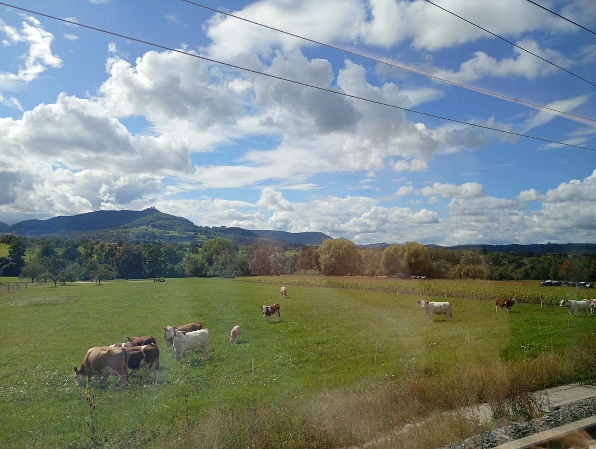
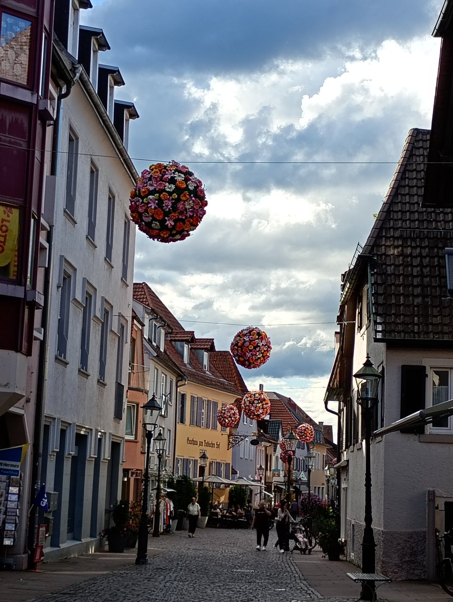

今日は初めてオマ（ドイツ語でおばあちゃんという意味）親戚の住んでいるカールスルーエに行きました。カールスルーエはフランスの国境にとても近いところにある街です。

まず、ドイツ中央駅からカールスルーエ行きの電車に乗りました。机付きのいい席が取れて、良かったです。

窓からは広々とした景色を見れます。そしてこの日、とても珍しいことが起きました😲いつもは、普通に遅刻などをしているドイツの電車なのですが、（😅）「〇〇駅に一分早くつきました。申し訳ございません」という放送が流れたのです！遅れて、謝罪はよくありますが早くついた、ましてや一分とほぼ変わらない時間についての謝罪は電車に乗っていた他の乗客も初めてだようで、車内は驚きの会話と笑い声があふれました😅

そんな珍しいことが起きたりしながら、無事三時間ほどで着きました😊親戚のイエレスが迎えに来てくれて、パンクーヘンという薄いパンケーキみたいな生地にほうれん草とチーズを挟んだパイを食べました。トマトソースをかけます。とても美味しかったです😋

そのあと、曽祖父と曾祖母のお墓を訪れてオパ（ドイツ語でおじいちゃんという意味）が生まれ育った家も見に行きました。そのあと隣町にある城下町を観光しました😊

ついこの間お祭りがあったみたいで、丸くお花を飾って吊ってありました🌹

そのあとカールスルーエの目玉であるカールスルーエ城で、ライトアップがあるというので見に行きました🔦

音楽も流されていていろんな形に変わったりしてきれいでした🤩
