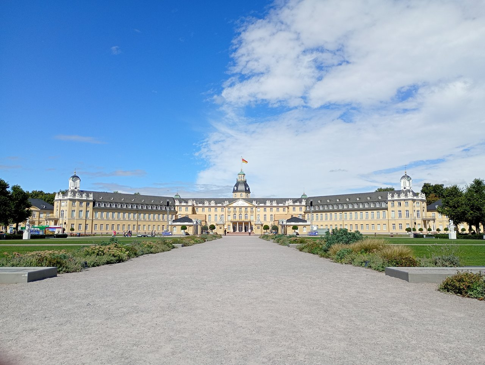
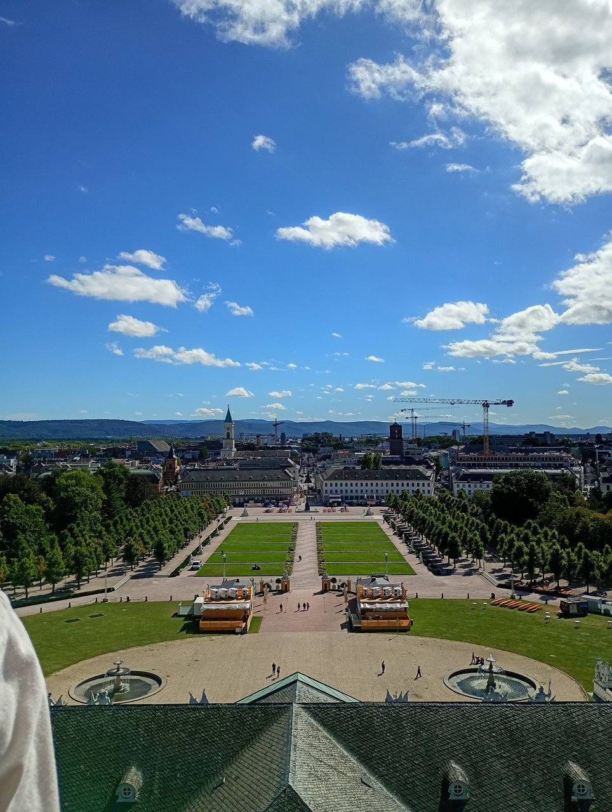

今日はカールスルーエ２日目です。昨日はライトアップでかっこ良かったカールスルーエ城の昼の姿を見に行きました。

昨日の現代的なお祭りと同じだと思えないほど厳かな雰囲気がある、立派なお城でした😍

# カールスルーエ城とは

* **カール３世ヴィルヘルムが自分の新しい居城として１７１５年に建設。**
* 彼は、「自然の中で静かに暮らしたい」と思って、森の中に城を建て、その周りに街を作りました。
* 街は**城から放射線状に32本の道が広がる、扇のような街並み**になるように作られました。（地図に名残を見つけれるので、ぜひ見てみてください👀）このユニークな都市計画により現在も**「扇の街」**と呼ばれています。
* 城は、バロック式に建てられ、改変や拡張を繰り返して18世紀〜19世紀にかけて「バーデン大公」の居城として**政治・文化の中心地**になったまちです。

この城の庭園はとても広くて、広大な芝生とアヒルなどの鳥が泳ぐ池があり、ちいさな電車のような乗り物にも乗れるほどです🌻

そのあと、この城の目玉でもある、城のてっぺんの塔から街を一望しました👀

天気もとても良くて、きれいな眺めでした。ただ、塔に登るには階段しか手段がないだけでなく、かなり急なもので苦戦している方が多くいました😅

今日は、ドイツのお城についてもたくさん知ることができました！それに、とても楽しかったです😊
