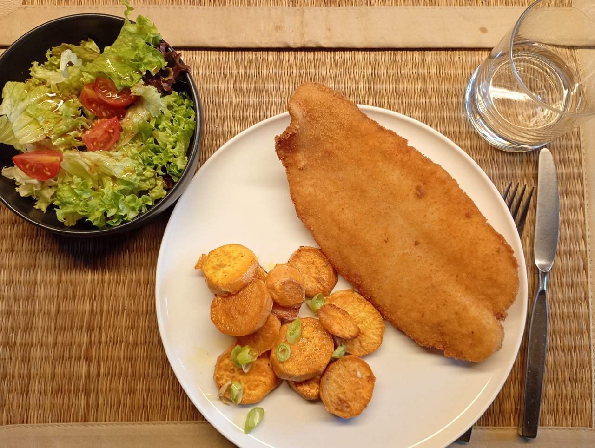

今日の昼ご飯は魚のフライでした！

この魚のフライはこの前食べた鮭が売っていた店で買いました。新鮮なコントで有名なそのお店は、このフライが人気で並ぶほどだと言います😲

味は…今までで食べた魚のフライの中で1、2位をあらそうほどの美味しさ！外の衣はとてもカリカリで、身はふわふわで、全然魚臭くなくて…とても美味しかったです。正直、ミュンヘンは海からとても遠いので味には日本ほど期待をしていなかったのですが、こんなにも美味しいとは！😋また食べたいです！
