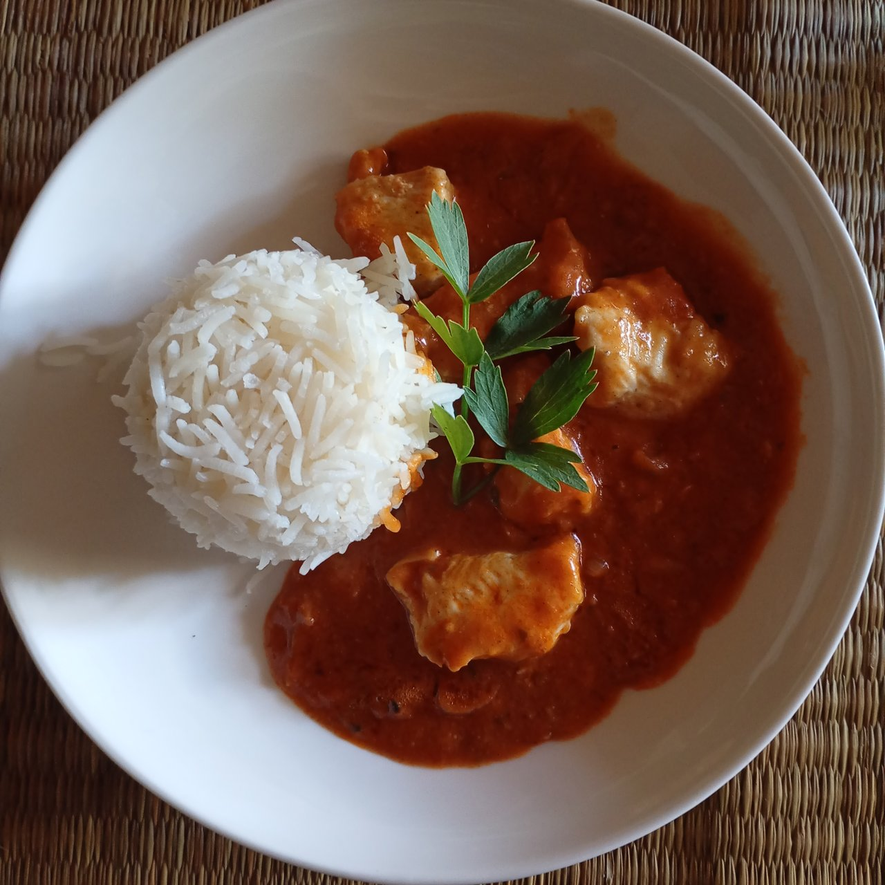

今日の昼ご飯はインドカレーでした🇮🇳🍛

鶏肉が入っていてちょっと辛くなっています。ごはんは、日本の米より細長くてパラパラした食感のヒマラヤ米です。私がもっと小さかったときは、パラパラした米が衝撃で、こんなの米じゃない！！なんていってあまり好きではありませんでした😅しかし、最近この食感が辛めのスープやソースなどと組み合わせて食べるのが、日本の米よりも合うということに気がついて、**米はどの種類でも美味しい！** という結論に行き着きました😊

しかも面白いのが、このレシピを作った人は、日本人ということです😲なんか色々繋がってて面白いな〜と思いました😊
