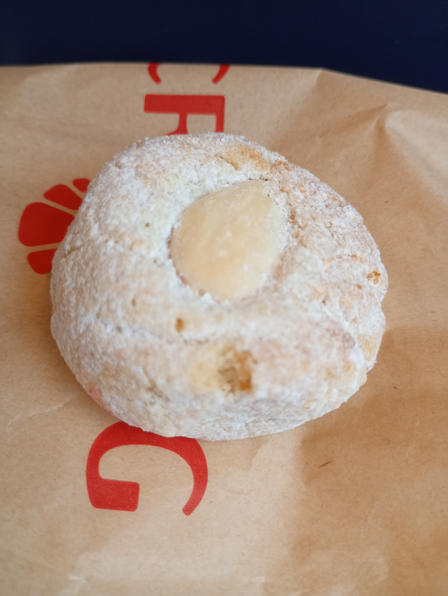
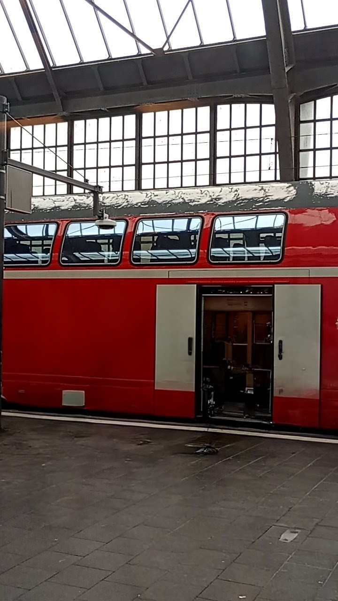

今日はゆっくり朝を過ごしてから、十二時頃にカールスルーエ中央駅に向かいました🚃

駅についた途端知らない女の人が声をかけてきました。彼女は小銭を見せながら「お金が足りないんです。私の電車のチケットを買ってくれますか？」オマ（ドイツ語でおばあちゃんという意味）は断りましたが、このような少しよくわからない出来事がありました🤔皆さんはこうなったとき、どうしますか？

そのあと、昼ごはん用のサラミとチーズのサンドイッチを買いました。あとスナックが売ってある店を探すため駅をウロウロしていたらイタリアのクッキーが売っている店を見つけました🍪

写真のクッキーの中にはレモン味のマジパンが入っていてマジパン好きの私にとっては最高でした😋ただ、そこまで大きいクッキーではないのに1つ食べたらお腹が膨れるのでついついたくさん食べてしまう私にはぴったりです😅

もう一つ、二階だての電車がありました。（写真は消しゴムマジックで人を消したので多少不自然ですが…）

今回も三時間ほどでつきました。疲れましたが楽しかったです！
