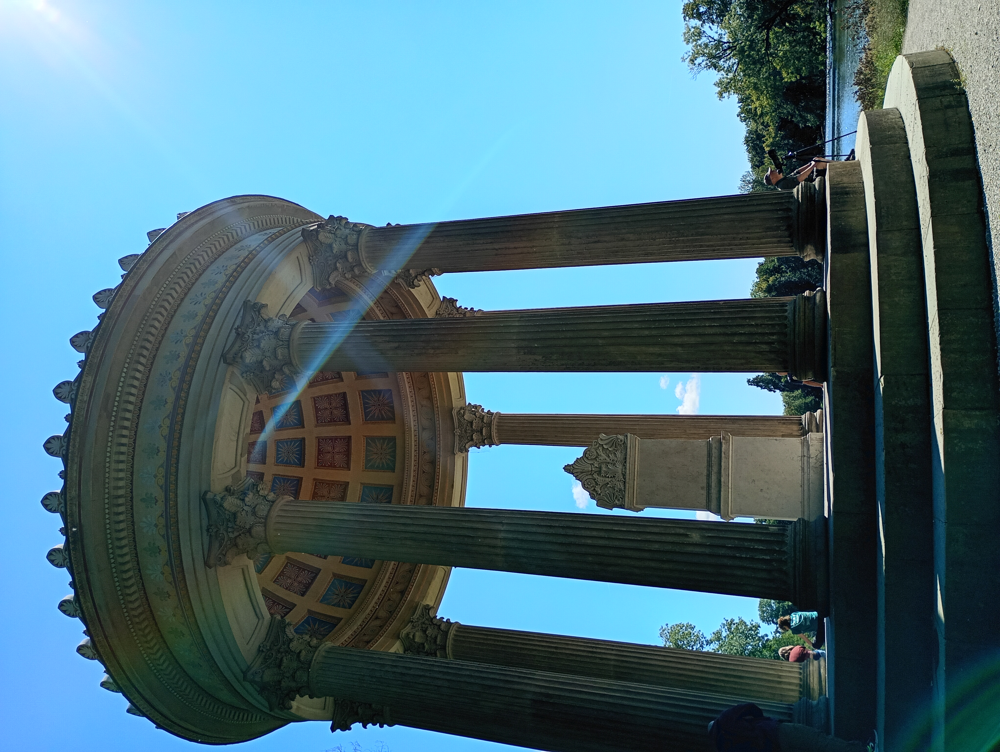

今日は、ドイツのミュンヘンにあるニンフェンブルクに行きました。今まで、ザルツブルク城やカールスルーエ城などの城を観光しましたが、さすがヨーロッパ最大級のバロック式宮殿、別格でした（あくまで個人の感想ですし、そもそもヨーロッパのお城も両手に収まるほどしか見たことがないのですが…😅）

では、別格ポイントを２つ、特に気に入ったところを１つに絞って紹介します✨

まず1つ目は…

# 『とにかく、宮殿が大きい！』

どれぐらい大きいかと言うと **横幅700ｍ以上！** 中心部分だけでも広くて、コの字になっているサイドの翼廊もあって、すべてがカメラに収まり切らないほどです😲しかも、メインの城には金の装飾もされていて、大きいだけでなくデザインも素敵でした✨宮殿内には入っていませんが、とても美しくて広いそうです。

２つ目は…

# 『庭園の規模がスゴイ！！』

さきほど、宮殿の中に入っていないと書いて、「宮殿を見ずに、一体何をしたんだ？」と思った方もいると思います。その理由はズバリ！ **一日中庭園を散策していたから！！** このニンフェンブルクは、宮殿だけが見どころではありません！この場所の見どころは池や運河が含まれる **約１８０ヘクタール（東京ドーム約３８個分）** もの広い庭園です🌻

元々はベルサイユ宮殿を手本にして、左右対称の直線的なデザインで作られていましたが（フランス式庭園🇫🇷）、１８世紀後半に改造されて森や池、小川があり、自然な風景を楽しめるスタイル（イギリス式自然風景庭園🇬🇧）が加えられました。また、宮殿の前には一直線にに伸びる運河があり、敷地の外の運河とつながっています。

運河では、船にも乗れます🛶

こんな自然豊かなところが都市なんて、ましてや宮殿の敷地内なんでビックリですよね😲

本当にきれいなところです🌳天気も最高でした🌞

私のお気に入りの場所は…

# 『庭園にいくつも点在する小さな宮殿』

ニンフェンブルクの庭園には、いくつかある「小宮殿」がとても有名です。おもに、４つの小宮殿があります。

* アマリエンブルク→ロココ様式で華やかな妃マリア・アマリアのための狩猟用離宮
* バーデンブルク→豪華な浴場
* パゴデンブルク→東洋風な建物

  
* マンダルテンブルク→ギリシャ神殿風の円形建築（特にこれが好きです✨）
* 
* マグダレーナ陰修道院→廃墟を演出した礼拝堂

もちろん全て回れたわけだはありませんが、とても凝ってあってすてきでした。

とても充実した一日になりました。まだ回れていないところもあるのできっともう一度訪れたいです。みなさんも機会があれば行ってみてください！おすすめです！！

ちなみに日本人観光客も多く至るところから（懐かしい）日本語が聞こえてきて嬉しかったです😊
