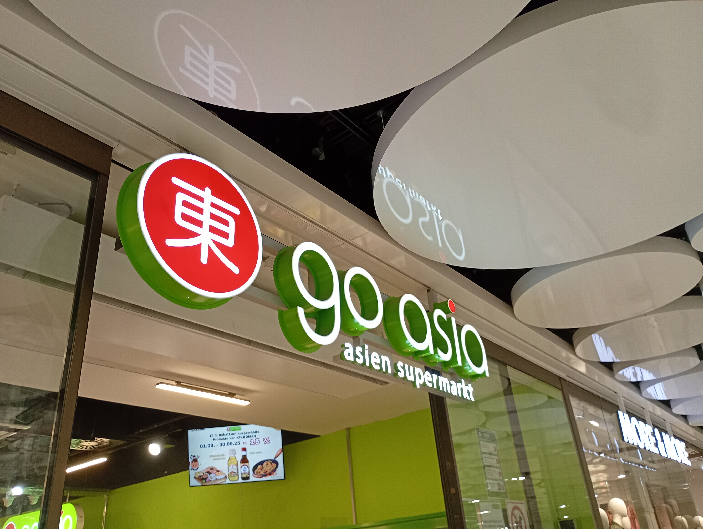

今日は、ミュンヘンにあるアジアショップ「go asia」に行きました。

最近アジア、特に日本が人気になっており、こういう店も増えてきています。しかし、ほんとに日本の食材が売っているのでしょうか？人気だからといいても、本物の日本の食材は流石に売っていないだろう…この予想は、この店に入った瞬間に裏切られました。

「み、みみみみ、味噌？！！！！しかも、信州味噌！日本のスーパーに普通に売っているやつやん！」と心の中で驚きでひっくり返ってしました。しかし、これからもっとスゴイのが待ち受けていたのです。

ビール大国のドイツに、日本のビールが売っていたのです😲🍺しかも、日本よりも種類があるのではないかと疑うほど、たくさんのラムネも。🥤

ほかにも、うどんやラーメンはあっても、これだけは知らないだろうと思っていたそうめんやポン酢に醤油なんかは、何種類もあったんです。ポッキーや、冷凍の三色団子、秋田県産のお米、外国人が基本2がtな納豆まで、三種類も売っていました🍡🍚

また日本だけでなく、韓国、中国、ベトナムにタイなどの食材も多くありました。

本当にびっくりしましたが一つ確かなことを学ぶことができました。それは…ドイツに行くときはもう、スーツケースいっぱいに日本の食材を詰め込まなくてもいいということ！！日本食が恋しくなればこの店で調達できる！ドイツに住むことに対してのハードルが少し下がったような気がします😅
