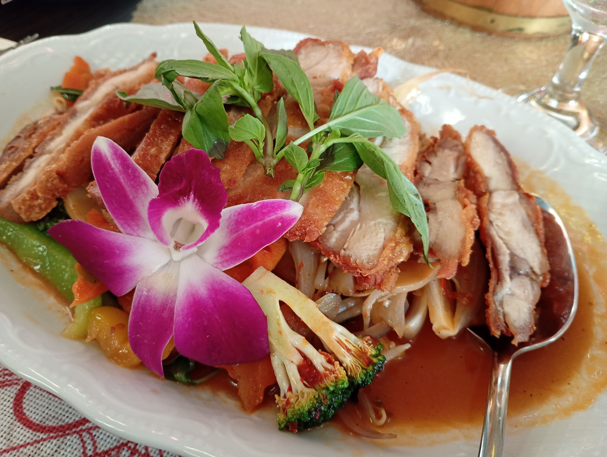
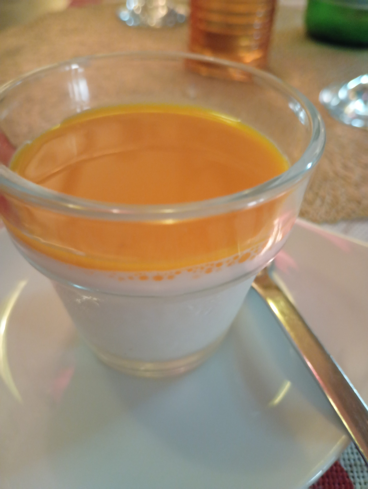
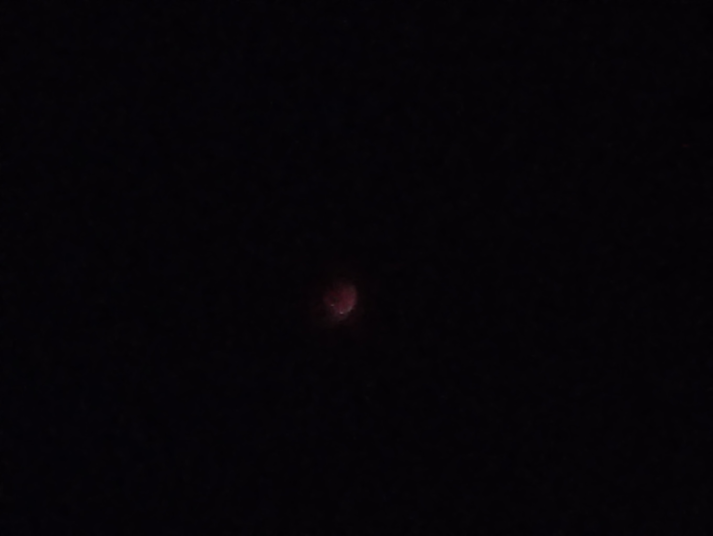

今日は、三年に一度の皆既月食が見られる日でした！ニュースに流れてきたので、屋上で見ることにしました。しかし、皆既月食が始まるのは七時半ごろで、時間があったのでオマ（ドイツ語でおばあちゃんという意味）が家族の誕生日でもあるということで、タイ料理の店に連れて行ってくれました😋ドイツにはかなりたくさんアジアのレストランがあって、私もいくつか言ったことがあるのですが、今回のタイ料理は今までで一番美味しかったです🇹🇭

カレーを頼んだのですが、とてもたくさん野菜がはいっていてピリ辛にシャリシャリした爽やかな味がしました。写真を見る通り盛り付けもとてもきれいで、お米が別に小さな釜から取る形式で、食べるときも楽しかったです。また、なんと！！サービスでマンゴーソースをかけた杏仁豆腐とココナッツをミックスした感じ（つまり美味しい）のデザートをいただきました😍

写真はあまりきれいではありませんが、口の中でとろける杏仁豆腐のようなものが美味しいのはもちろんのこと、それにかかっているマンゴーソスはマンゴーがそこまで好きではない私も感動してしまいました🥭

そしてるんるんの気持ちで家に帰り、皆既月食はどこだどこだと探しましたが、月が見えません😱場所を変えたり、GPT先生に見つけやすい方法を聞いたりしながら、探すこと２もはや疲れてきて約一時間…かすかに丸い黒っぽい物体が空に見えました！！やっと、みつけた…その時の喜びはいいようもありませんでした。霧がでていて、見つけにくかったそうです😱カメラの性能はあまり良くありませんが、感動の月食を載せます。

かすかに赤黒いものが見えるはずです。つぎの2028年こそ、美しい赤色の月を📸におさめてみせます！
